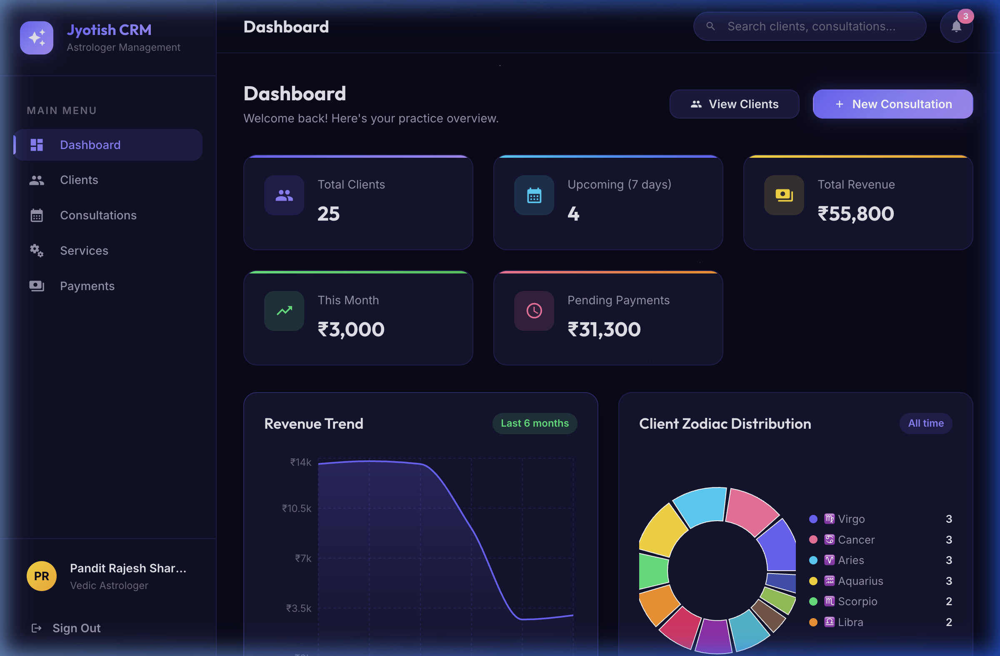

# 🔮 Jyotish CRM — Astrologer Management System

A full-stack CRM application built for astrologers to manage their practice — clients, consultations, birth charts, services, and payments.



## ✨ Features

### Dashboard
- **Real-time statistics** — Total clients, upcoming consultations, revenue tracking
- **Revenue trend chart** — 6-month revenue visualization
- **Zodiac distribution** — Pie chart showing client zodiac sign distribution
- **Quick access** — Upcoming consultations and recent clients at a glance

### Client Management
- **Full CRUD** — Add, edit, delete clients
- **Birth details** — Date, time, and place of birth
- **Auto-calculated** — Zodiac sign and Nakshatra from birth date
- **Search & filter** — Search by name/email/phone, filter by zodiac sign
- **Client profiles** — Detailed view with consultation history and payment summary

### Birth Chart (Kundli)
- **SVG visualization** — North Indian style Kundli chart
- **Planetary positions** — Simplified planetary placement based on birth date
- **Zodiac house mapping** — Visual representation of 12 houses

### Consultation Scheduling
- **Schedule appointments** — Select client, service, date/time
- **Status management** — Track scheduled, completed, and cancelled sessions
- **Service-linked** — Auto-populate duration and pricing from service catalog
- **Inline actions** — Mark complete or cancel directly from the table

### Service Catalog
- **Manage offerings** — Kundli Reading, Matchmaking, Career Guidance, Gemstone Consultation, Vastu, Numerology, etc.
- **Pricing & duration** — Set per-service pricing and session duration
- **Icon selection** — Visual icon picker for each service
- **Usage tracking** — See how many consultations each service has

### Payment Tracking
- **Transaction history** — Complete payment record with method tracking
- **Summary stats** — Total received, refunded, and transaction count
- **Filter by method** — Cash, UPI, Card
- **Auto-creation** — Payment records auto-generated when consultations are completed

### Authentication
- **JWT-based** — Secure token authentication
- **Registration** — Create new astrologer accounts
- **Persistent sessions** — 7-day token validity

---

## 🛠️ Tech Stack

| Layer | Technology |
|-------|-----------|
| **Frontend** | React 19, Vite, React Router DOM |
| **Styling** | Vanilla CSS (custom cosmic dark theme) |
| **Charts** | Recharts |
| **Icons** | React Icons (Material Design) |
| **Notifications** | React Hot Toast |
| **Backend** | Node.js, Express.js |
| **Database** | SQLite (via better-sqlite3) |
| **Authentication** | JWT (jsonwebtoken), bcryptjs |
| **IDs** | UUID v4 |

---

## 🚀 Getting Started

### Prerequisites
- Node.js 18+ installed
- npm or yarn

### Installation

1. **Clone the repository**
   ```bash
   git clone https://github.com/yourusername/astrologer-crm.git
   cd astrologer-crm
   ```

2. **Install backend dependencies**
   ```bash
   cd server
   npm install
   ```

3. **Seed the database** (populates demo data)
   ```bash
   npm run seed
   ```

4. **Start the backend server**
   ```bash
   npm start
   # Server runs on http://localhost:5001
   ```

5. **Install frontend dependencies** (new terminal)
   ```bash
   cd client
   npm install
   ```

6. **Start the frontend**
   ```bash
   npm run dev
   # App runs on http://localhost:5173
   ```

### Demo Credentials
```
Email: rajesh@astrologercrm.com
Password: password123
```

---

## 📁 Project Structure

```
astrologer-crm/
├── client/                          # React frontend
│   ├── src/
│   │   ├── components/
│   │   │   ├── charts/BirthChart.jsx    # Kundli SVG visualization
│   │   │   └── layout/                  # Sidebar, Header, Layout
│   │   ├── context/AuthContext.jsx       # Authentication state
│   │   ├── pages/                       # Route-level components
│   │   │   ├── Dashboard.jsx
│   │   │   ├── Clients.jsx
│   │   │   ├── ClientDetail.jsx
│   │   │   ├── Consultations.jsx
│   │   │   ├── Services.jsx
│   │   │   ├── Payments.jsx
│   │   │   ├── Login.jsx
│   │   │   └── Register.jsx
│   │   ├── services/api.js              # Axios API service layer
│   │   ├── utils/helpers.js             # Utilities, constants
│   │   ├── App.jsx                      # Routing & auth
│   │   ├── index.css                    # Complete design system
│   │   └── main.jsx                     # Entry point
│   └── package.json
├── server/                          # Node.js + Express backend
│   ├── config/db.js                     # SQLite setup & schema
│   ├── middleware/auth.js               # JWT middleware
│   ├── routes/
│   │   ├── authRoutes.js                # Login, Register, Profile
│   │   ├── clientRoutes.js              # Client CRUD
│   │   ├── consultationRoutes.js        # Consultation CRUD
│   │   ├── serviceRoutes.js             # Service CRUD
│   │   ├── dashboardRoutes.js           # Analytics & stats
│   │   └── paymentRoutes.js             # Payment tracking
│   ├── seeds/seed.js                    # Demo data generator
│   ├── server.js                        # Express entry point
│   └── package.json
├── README.md
├── PROJECT_NOTES.md
└── AI_USAGE.md
```

---

## 📡 API Endpoints

### Authentication
| Method | Endpoint | Description |
|--------|----------|-------------|
| POST | `/api/auth/register` | Register new astrologer |
| POST | `/api/auth/login` | Login |
| GET | `/api/auth/me` | Get current user profile |

### Clients
| Method | Endpoint | Description |
|--------|----------|-------------|
| GET | `/api/clients` | List clients (search, filter, paginate) |
| GET | `/api/clients/:id` | Client details with consultations |
| POST | `/api/clients` | Create client |
| PUT | `/api/clients/:id` | Update client |
| DELETE | `/api/clients/:id` | Delete client |

### Consultations
| Method | Endpoint | Description |
|--------|----------|-------------|
| GET | `/api/consultations` | List (filter by status/date) |
| GET | `/api/consultations/upcoming` | Upcoming 7 days |
| GET | `/api/consultations/:id` | Details with payments |
| POST | `/api/consultations` | Schedule consultation |
| PUT | `/api/consultations/:id` | Update/complete |
| DELETE | `/api/consultations/:id` | Delete |

### Services
| Method | Endpoint | Description |
|--------|----------|-------------|
| GET | `/api/services` | List all services |
| POST | `/api/services` | Create service |
| PUT | `/api/services/:id` | Update service |
| DELETE | `/api/services/:id` | Delete service |

### Dashboard & Payments
| Method | Endpoint | Description |
|--------|----------|-------------|
| GET | `/api/dashboard/stats` | Aggregated statistics |
| GET | `/api/dashboard/recent-activity` | Recent activity |
| GET | `/api/payments` | Payment history |

---

## 🎨 Design

- **Theme**: Cosmic dark theme with deep indigo, purple accents, and gold highlights
- **Typography**: Inter (body) + Outfit (headings) from Google Fonts
- **Visual effects**: Glassmorphism, animated star background, gradient cards
- **Charts**: Recharts with custom cosmic-themed tooltips
- **Birth Chart**: Custom SVG North Indian style Kundli
- **Responsive**: Fully responsive from mobile to desktop

---

## 🧪 Seed Data

The seed script creates:
- 1 demo astrologer account
- 25 clients with realistic Indian names and birth details
- 8 astrology services with pricing
- 77 consultations (mix of completed, scheduled, and cancelled)
- 43 payment records

---

## 📝 License

MIT
